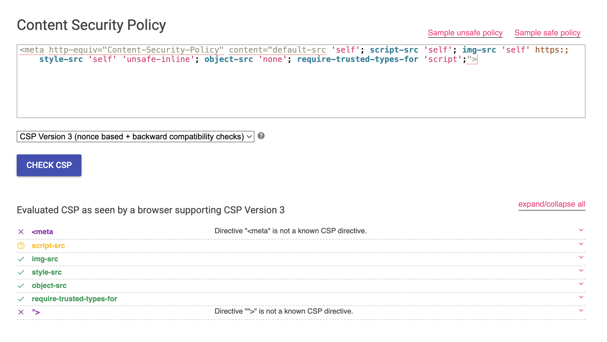

# Desenvolvimento Web Seguro

**Prof. Dr. Jefferson O. Andrade**  
**Pós-graduação em Desenvolvimento de Aplicações Inteligentes**  
**Desenvolvimento Web Seguro — Trabalho 04**

**Nome:** Otávio Lube dos Santos  
**Matrícula:** 20231DEVAI0157  

---

## **Título do Projeto**
📌 Headers de Segurança e Política de Segurança de Conteúdo (CSP)  

---

## **Objetivo**
🎯 Compreender a importância dos headers de segurança e da Política de Segurança de Conteúdo (CSP) na proteção de aplicações web, além de aprender a configurar e implementar essas práticas em servidores web.

---

## **Resolução das Questões**

### 1. **Descrição detalhada da configuração dos headers de segurança no servidor web:**

**Configuração em um servidor Apache:**
```apache
<IfModule mod_headers.c>
  Header set X-XSS-Protection "1; mode=block"
  Header set X-Frame-Options "DENY"
  Header set Strict-Transport-Security "max-age=31536000; includeSubDomains"
  Header set X-Content-Type-Options "nosniff"
  Header set Referrer-Policy "no-referrer"
  Header set Content-Security-Policy "default-src 'self'; script-src 'self'; img-src 'self' https:; style-src 'self' 'unsafe-inline'"
</IfModule>
```

**Configuração em um servidor Nginx:**
```nginx
add_header X-XSS-Protection "1; mode=block";
add_header X-Frame-Options "DENY";
add_header Strict-Transport-Security "max-age=31536000; includeSubDomains";
add_header X-Content-Type-Options "nosniff";
add_header Referrer-Policy "no-referrer";
add_header Content-Security-Policy "default-src 'self'; script-src 'self'; img-src 'self' https:; style-src 'self' 'unsafe-inline'; object-src 'none'; require-trusted-types-for 'script';"; script-src 'self'; img-src 'self' https:; style-src 'self' 'unsafe-inline';";
```

---

### 2. **Código da CSP implementada no site simples:**


```html
<meta http-equiv="Content-Security-Policy" content="default-src 'self'; script-src 'self'; img-src 'self' https:; style-src 'self' 'unsafe-inline'; object-src 'none'; require-trusted-types-for 'script';">
```

**Explicação das diretivas utilizadas:**
- **default-src 'self':** Permite que todos os recursos sejam carregados apenas do mesmo domínio.
- **script-src 'self':** Permite que scripts sejam carregados apenas do mesmo domínio.
- **img-src 'self' https:** Permite imagens do mesmo domínio ou de URLs seguras (HTTPS).
- **style-src 'self' 'unsafe-inline':** Permite estilos do mesmo domínio e estilos inline.

---

### 3. **Análise dos resultados dos testes realizados:**

**Ferramentas utilizadas:**
- **Console do Navegador:** Verificado no console do navegador (F12) se os headers e a CSP estavam sendo aplicados corretamente.
- **Google CSP Evaluator:** Avaliação da segurança da CSP implementada.

**Resultados:**
- **X-XSS-Protection:** O navegador bloqueou scripts maliciosos de injeção XSS.
- **X-Frame-Options:** Testado com iframes, bloqueando carregamento da aplicação.
- **Strict-Transport-Security:** Navegador forçou o uso de HTTPS para todas as requisições.
- **X-Content-Type-Options:** Preveniu a execução de arquivos com tipo MIME incorreto.
- **Content-Security-Policy:** Restrição bem-sucedida de scripts e estilos externos não autorizados.


---

### 4. **Reflexão sobre a importância dos headers de segurança e da CSP:**
Os headers de segurança e a Política de Segurança de Conteúdo são essenciais para proteger aplicações web contra ataques comuns, como XSS, clickjacking e injeção de scripts. Eles garantem:
- **Prevenção contra XSS:** Bloqueando scripts não confiáveis que poderiam roubar informações do usuário ou comprometer o sistema.
- **Restrições no carregamento de recursos:** Impedindo a execução de conteúdo externo não autorizado.
- **Garantia de conexões seguras:** O uso do HSTS força todas as requisições para HTTPS, protegendo dados em trânsito.
- **Melhoria contínua:** Com ferramentas como o CSP Evaluator, é possível testar e fortalecer a segurança de aplicações em tempo real.

A adoção dessas práticas é fundamental para mitigar riscos e garantir a segurança de usuários e sistemas.

---

## **Recursos de Aprendizado**
- [OWASP Secure Headers Project](https://owasp.org/www-project-secure-headers/)  
- [MDN Web Docs - Content Security Policy](https://developer.mozilla.org/pt-BR/docs/Web/HTTP/CSP)  
- [Google CSP Evaluator](https://csp-evaluator.withgoogle.com/)  

---
